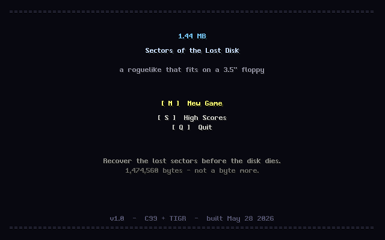
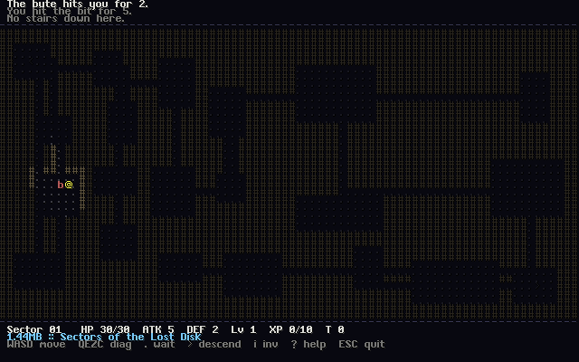
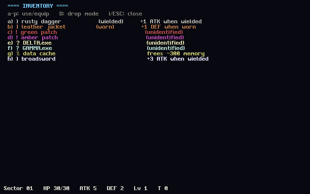
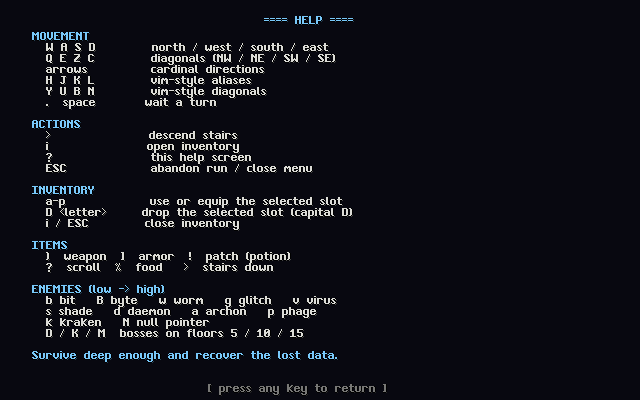

# 1.44 MB :: Sectors of the Lost Disk

A classic dungeon-crawl **roguelike** that fits on a single 3.5-inch HD floppy
disk. The whole game (executable, font, data, everything) is a **33,280-byte
standalone Windows executable** -- about 2.3 % of the 1,474,560-byte floppy
budget.

Built for the [1.44MB GAME_DEV CONTEST](https://2pgarcade.com/contest-144mb.html).



## Story

The floppy disk is dying. Its sectors are corrupting one by one, and the
**Master Boot Record** has been overwritten by something that should not be.
You are the last data-recovery routine in memory. Jack in, descend through
15 corrupted sectors, and restore the boot record before the disk fails.

## Gameplay

A turn-based dungeon crawler in the tradition of *Rogue* and *NetHack*:

- 15 procedurally generated floors built with recursive BSP partitioning
- Symmetric raycast field-of-view with tile memory
- 11 regular enemies + 3 unique bosses on the checkpoint floors (5, 10, 15)
- 20-item table: weapons, armor, patches (potions), scrolls, food
- Unidentified patches and scrolls get random pseudo-names (`red patch`,
  `ALPHA.exe`) -- the mapping is reshuffled every run
- Bump-to-attack combat with critical strikes and a level-up curve
- Hunger system thematically branded as **memory pressure**: ticks up every
  turn, stops regen at *Hungry*, drains HP at *Starving*
- Permadeath, high-score table persisted in a tiny `score.dat` (~232 bytes)



### Controls

```
W A S D         move (north / west / south / east)
Q E Z C         move diagonally (NW / NE / SW / SE)
arrows          cardinal directions
hjkl / yubn     vim-style aliases
.   space       wait one turn
>               descend stairs
i               open inventory
?               in-game help
ESC             abandon run (returns to title)
```

In inventory: `a-p` use/equip an item, `D` (capital) then `<letter>` drop, `i`/`ESC` close.




## Build

The game targets Windows (mingw-w64 cross-compile from macOS / Linux) but is
fully cross-platform. The Mac binary is used for development.

```bash
# Toolchain - one-time setup on macOS:
brew install mingw-w64 upx

# Development build (native, macOS or Linux):
make mac          # produces build/disk
make run

# Submission build (Windows .exe, UPX-compressed):
make submit       # produces build/disk.exe
                  # fails the build if it ever exceeds 1,474,560 bytes
```

There are no runtime dependencies. Just copy `build/disk.exe` to any
Windows machine and double-click.

## Size budget

The hard rule of the contest is **1,474,560 bytes** -- the physical capacity
of a 1.44 MB 3.5-inch HD floppy. The actual numbers from this build:

| Artifact                              | Size      | % of 1.44 MB |
|---------------------------------------|----------:|-------------:|
| Mac build (`clang -Os -flto`)         |    69 KB |          5 % |
| Win build (`mingw -Os -flto -s`)      |   131 KB |          9 % |
| Win build + `upx --best --lzma`       |  **33 KB** |    **2.3 %** |

We leave **1,441,280 bytes** unused on the floppy. The game would actually
fit on a 360 KB 5.25-inch floppy from 1983 with room to spare.

The full per-stage size log is in [`size-log.md`](size-log.md).

## Architecture

Pure C99, statically linked, **no runtime dependencies**:

- [src/main.c](src/main.c) -- entry point, input dispatch, state machine
- [src/game.c](src/game.c) -- game loop, message log, turn order, regen, hunger
- [src/map.c](src/map.c) -- BSP dungeon generation, raycast FOV
- [src/mob.c](src/mob.c) -- spawning, AI (chase / erratic / teleport), combat
- [src/item.c](src/item.c) -- inventory, equipment, identification, effects
- [src/score.c](src/score.c) -- binary high-score persistence (`score.dat`)
- [src/ui.c](src/ui.c) -- rendering (title, help, hiscore, inventory, map)
- [src/rng.c](src/rng.c) -- 32-bit xorshift PRNG
- [src/data.c](src/data.c) -- static tables: monsters, items, pseudo-names
- [src/game.h](src/game.h) -- all shared types and prototypes
- [third_party/tigr.{h,c}](third_party/) -- TIGR ("TIny GRaphics") by erkkah,
  public-domain single-file graphics + input library

The entire game state lives in one `Game` struct (~12 KB) including the map
grid, mobs, floor items, inventory, knowledge of pseudo-names, message log,
and high-score table.

## Theme

> Bit by bit, the disk is rotting. Every step you take spins the platter
> one more revolution. Every patch you apply, every scroll you execute,
> every monster you defeat reclaims a few more bytes of pristine data.
> Recover the boot record. Don't let the disk die.

## Credits

- Game design + code: this entry
- [TIGR](https://github.com/erkkah/tigr) graphics library by erkkah,
  released into the public domain

## License

MIT-0 / public domain. Do whatever you want.
